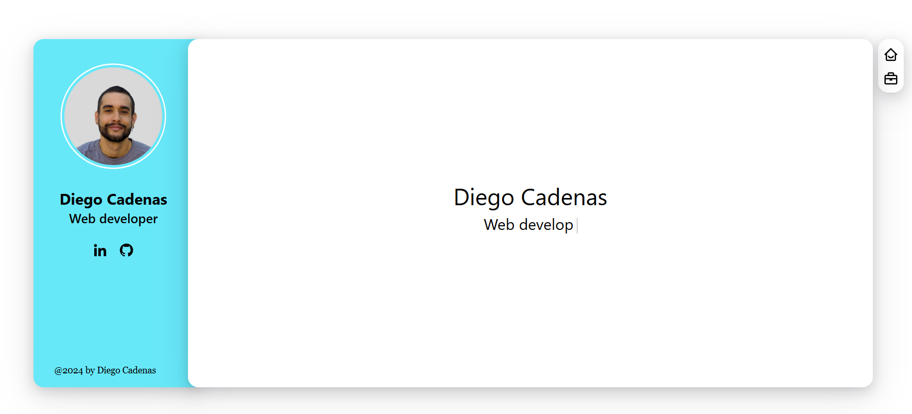

# My portfolio 👨‍💻

## My online presence on internet. 

This project is a React-based web programm, it uses tailwindcss for styling. 

  

### How to install:

If you want get this project as template for your own, just follow these steps:
- Clone the repo: `git clone https://github.com/skyx20/Portfolio-.git`
- Install all the dependencies: `npm i` 

## how to run
- `npm run dev` to run the app

### Enjoy 😊
